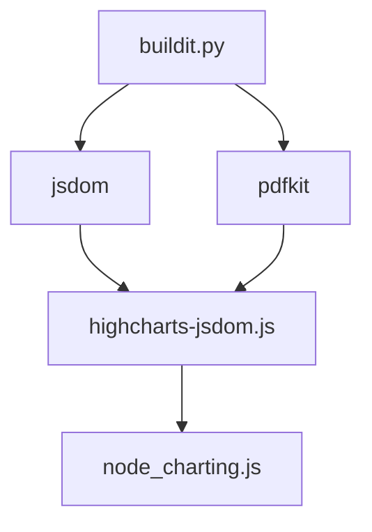

# PDF Generation

## Summary

These files are used to generate PDF's for Simple XML dashboards.

## Resources

* [PDF Generation Architecture](https://splunk.atlassian.net/l/c/6Wnrn9tc)
* [Troubleshooting Runbook](https://splunk.atlassian.net/l/c/KzuSge5D)
* [PDF Generation Code Walkthrough](https://splunk.atlassian.net/l/c/NrLJULEn)
* [PDFgen Test Plan](https://splunk.atlassian.net/l/c/Lpd1CVML)

## Debugging

`log-local.cfg` is the method of raising the log level . This file should be added (if not already existing) at `$SPLUNK_HOME/etc/log-local.cfg`. For example is:

```
[python]
splunk = DEBUG
splunk.appserver = DEBUG
splunk.appserver.controllers = DEBUG
# at DEBUG level the proxy controller will log the contents of all requests and responses
# this can be very verbose and is not recommended for production use
splunk.appserver.controllers.proxy = DEBUG
splunk.appserver.lib = DEBUG
splunk.pdfgen = INFO
splunk.archiver_restoration = INFO
```

[source](https://splunk.atlassian.net/browse/SPL-205550?focusedCommentId=7169158)


## PDFKit, highcharts-jsdom, node_charting.js

How PDFKit is being used inside highcharts-jsdom for node_charting.js.



[source](https://splunk.atlassian.net/browse/SPL-195186?focusedCommentId=5273876)
